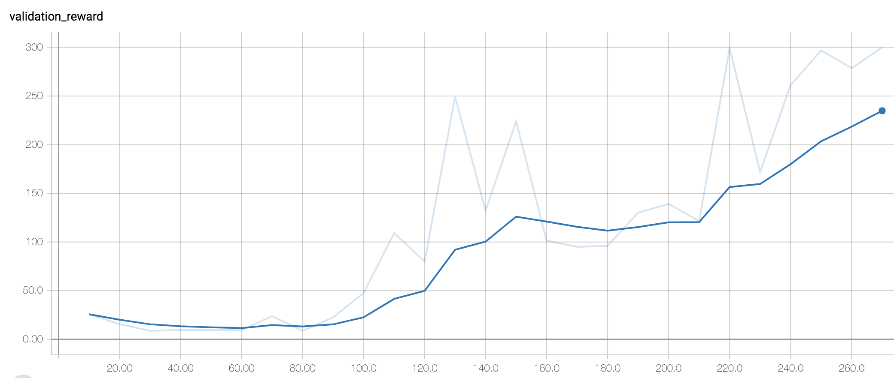
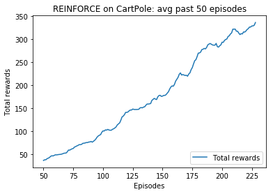
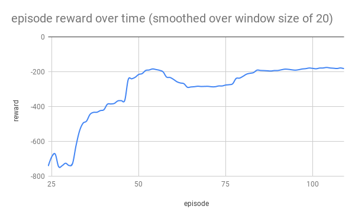

Collection of my implementation of reinforcement learning algorithms

## Deep RL

- [DQN](https://github.com/xysun/rl-algorithms/blob/master/dqn.py)
    - Use negative reward to punish terminal state
    - Let Tensorflow do as much batch processing as possible (I was doing individual inference sequentially for a training batch, lots of time wasted)
    - During Q target update, must use network's **current** weight for `Q_s(t+1)`, instead of the weight during that particular observation.
    - Provide all action space to training! `MSE(q_update, max(prediction))` is wrong, because the `max(prediction)` can be from a different action than what was recorded in experience and was used for Q update.
    - Smoothed performance over episodes: (lighter blue line is unsmoothed) 
        

## Classical RL:

- [REINFOCE with continuous action](https://github.com/xysun/rl-algorithms/blob/master/reinforce_continuous.py)
    - Parametralize mean and standard deviation of a normal distribution
    - mean is linear model; standard deviation is `exp(linear)`
    - Does not seem to converge as of episode 1000 :( Although the solution given [here](https://github.com/dennybritz/reinforcement-learning/blob/master/PolicyGradient/Continuous%20MountainCar%20Actor%20Critic%20Solution.ipynb) does not converge either :shrug:
- [actor-critic with CartPole](https://github.com/xysun/rl-algorithms/blob/master/actor_critic.py)
    - Important: use a powerful enough function approximator for value critic
- [REINFORCE with CartPole](https://github.com/xysun/rl-algorithms/blob/master/reinforce.py)
    - 
    - In Bernoulli output: `sigmoid(y) !== P(y)`; instead, `P(y) = sigmoid((2y-1)z)`, where `z` is output of linear unit
    - auto gradient FTW! \o/
- [Linear function approximation with mountain car, with my own tile encoding implementation](https://github.com/xysun/rl-algorithms/blob/master/linear_fa_mountain_car.py)
    - 
    - learning rate is important
    - epsilon decay is important
- [Q-learning](https://github.com/xysun/rl-algorithms/blob/master/q_learning.py)
- [Sarsa](https://github.com/xysun/rl-algorithms/blob/master/sarsa.py)
- [Monte Carlo Prediction & Control with Exploring Starts](https://github.com/xysun/rl-algorithms/blob/master/Monte-Carlo-Prediction-and-Control-with-Exploring-Starts.ipynb)
  - reproduced black jack solution from Sutton book
- [Policy evaluation & iteration, value iteration](https://github.com/xysun/rl-algorithms/blob/master/Policy-evaluation-Policy-iteration-and-Value-Iteration.ipynb)
